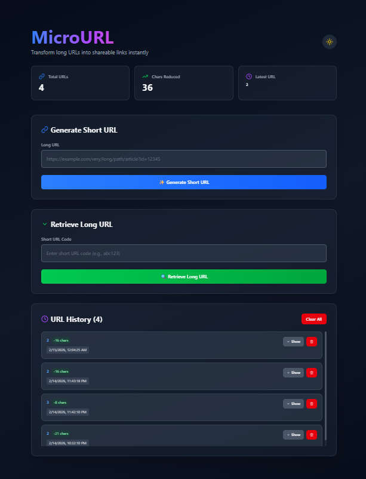

# MicroURL - URL Shortener



Transform long URLs into shareable links instantly with QR code generation, analytics, and Redis-backed high-performance redirects.

## 🌟 Features

- **⚡ Instant URL Shortening** - Convert long URLs into compact, shareable short links
- **📱 QR Code Generation** - Automatically generate QR codes for each shortened URL
- **📊 URL History** - Track and manage all your shortened URLs
- **📋 Copy to Clipboard** - One-click copying of short URLs
- **🎨 Modern UI** - Clean, intuitive interface with dark mode
- **⚙️ Base62 Encoding** - Efficient encoding for compact URL codes
- **🚀 Fast & Reliable** - Redis-backed storage for instant retrieval
- **📈 Analytics** - Per-URL click tracking with last-access timestamps

## 📸 Screenshots

### Dashboard


The MicroURL dashboard provides:
- Total URLs shortened statistics
- Chains redirected counter
- Latest URLs created
- URL generation interface
- URL retrieval system
- Complete URL history with timestamps

### Features in Action


## 🏗️ Architecture

```
┌─────────────────────────────────────────────────────────┐
│                    MicroURL System                       │
├─────────────────────────────────────────────────────────┤
│                                                          │
│  ┌──────────────┐              ┌──────────────┐        │
│  │  Next.js UI  │─────────────▶│  Express API │        │
│  │  • React     │              │  • Routes    │        │
│  │  • Tailwind  │              │  • Services  │        │
│  │  • TypeScript│              │  • Validation│        │
│  └──────────────┘              └──────────────┘        │
│                                        │                │
│                                        ▼                │
│                                  ┌──────────────┐      │
│                                  │    Redis     │      │
│                                  │  • Cache     │      │
│                                  │  • Storage   │      │
│                                  │  • History   │      │
│                                  └──────────────┘      │
│                                                          │
└─────────────────────────────────────────────────────────┘
```

## 📁 Project Structure

```
microurl/
├── client/                           # Next.js Frontend
│   ├── app/
│   │   ├── layout.tsx               # Root layout
│   │   ├── page.tsx                 # Home page
│   │   └── globals.css              # Global styles
│   ├── components/
│   │   ├── CopyButton.tsx           # Copy to clipboard
│   │   ├── Toast.tsx                # Toast notifications
│   │   └── UrlHistory.tsx           # History component
│   ├── lib/
│   │   └── validation.ts            # Input validation
│   ├── public/
│   │   ├── file.svg
│   │   ├── globe.svg
│   │   ├── next.svg
│   │   ├── vercel.svg
│   │   └── window.svg
│   ├── package.json
│   ├── tsconfig.json
│   ├── next.config.ts
│   ├── postcss.config.mjs
│   ├── eslint.config.mjs
│   └── README.md
│
├── server/                          # Express.js Backend
│   ├── services/
│   │   └── base_62_encoding_service.js  # Base62 encoding
│   ├── index.js                     # Server entry point
│   ├── package.json
│   ├── package-lock.json
│   ├── .env                         # Environment config
│   ├── .gitignore
│   └── README.md
│
├── assets/                          # Documentation & Images
│   ├── banner.png                   # Project banner
│   ├── dashboard.png                # Dashboard screenshot
│   ├── features.png                 # Features showcase
│   └── architecture.png             # System architecture
│
├── README.md                        # This file
├── .gitignore
└── package.json
```

## 🛠️ Tech Stack

### Frontend 🎨
| Technology | Version | Purpose |
|-----------|---------|---------|
| Next.js | 16.1.6 | React framework |
| React | 19.2.3 | UI library |
| TypeScript | 5 | Type safety |
| Tailwind CSS | 4 | Styling |
| Lucide React | 0.564.0 | Icons |
| QRCode React | 4.2.0 | QR codes |
| ESLint | 9 | Linting |

### Backend ⚙️
| Technology | Version | Purpose |
|-----------|---------|---------|
| Express.js | 5.2.1 | Web framework |
| Redis | 5.10.0 | Data store |
| CORS | 2.8.6 | Cross-origin |
| Dotenv | 17.3.1 | Config |
| Node.js | 18+ | Runtime |

## 🚀 Quick Start

### Prerequisites
```bash
- Node.js 18 or higher
- npm or yarn
- Redis (local or cloud instance)
```

### 1️⃣ Clone & Setup

```bash
# Clone repository
git clone https://github.com/yourusername/microurl.git
cd microurl

# Install server dependencies
cd server
npm install

# Install client dependencies
cd ../client
npm install
cd ..
```

### 2️⃣ Configure Environment

Create `.env` file in the `server` directory:

```env
PORT=3001
DOMAIN=http://localhost:3001
REDIS_URL=redis://localhost:6379
```

### 3️⃣ Start Services

**Terminal 1 - Server:**
```bash
cd server
npm start
# ✅ Server running on http://localhost:3001
```

**Terminal 2 - Client:**
```bash
cd client
npm run dev
# ✅ Client running on http://localhost:3000
```

### 4️⃣ Open in Browser

Navigate to [http://localhost:3000](http://localhost:3000)

## 📚 Documentation

| Document | Purpose |
|----------|---------|
| [Client README](./client/README.md) | Frontend guide, components, features |
| [Server README](./server/README.md) | API documentation, endpoints, services |

## 🔌 API Reference

### Shorten URL
**POST** `/api/shorten`
```bash
curl -X POST http://localhost:3001/api/shorten \
  -H "Content-Type: application/json" \
  -d '{
    "url": "https://example.com/very/long/url/path"
  }'
```

**Response:**
```json
{
  "shortCode": "abc123",
  "shortUrl": "http://localhost:3001/abc123",
  "originalUrl": "https://example.com/very/long/url/path",
  "qrCode": "data:image/png;base64,...",
  "createdAt": "2026-02-15T10:30:00Z"
}
```

### Redirect to Original
**GET** `/:code`
```bash
curl -L http://localhost:3001/abc123
# Redirects to original URL
```

### Get History
**GET** `/api/history`
```bash
curl http://localhost:3001/api/history
```

**Response:**
```json
{
  "total": 5,
  "urls": [
    {
      "shortCode": "abc123",
      "originalUrl": "https://example.com/very/long/url",
      "createdAt": "2026-02-15T10:30:00Z",
      "clicks": 15
    }
  ]
}
```

### Get Statistics
**GET** `/api/stats/:code`
```bash
curl http://localhost:3001/api/stats/abc123
```

## 💾 Data Model

### Redis Schema

```
url:{shortCode}
├── originalUrl: string
├── createdAt: timestamp
├── clicks: number
└── lastAccessed: timestamp

url:counter
├── currentId: number (auto-increment)

url:history
├── {shortCode}: timestamp (sorted set)
```

## 🎨 Components Overview

### CopyButton
```tsx
// Copies URL to clipboard with visual feedback
<CopyButton text={shortUrl} />
```

### Toast
```tsx
// Shows notifications
<Toast message="URL copied!" type="success" />
```

### UrlHistory
```tsx
// Displays shortened URLs list
<UrlHistory urls={urls} onDelete={handleDelete} />
```

## 🔄 Workflow

```
User Input (URL)
    ↓
Validation Check
    ↓
Base62 Encoding
    ↓
Redis Storage
    ↓
QR Code Generation
    ↓
Display Short URL + QR
    ↓
Add to History
```

## 🔒 Security Features

✅ **Input Validation** - All URLs validated before processing  
✅ **CORS Protection** - Configured for specific origins  
✅ **Type Safety** - Full TypeScript implementation  
⚠️ **Rate Limiting** - (Recommended) Implement for production  
⚠️ **HTTPS** - (Required) For production deployment  
⚠️ **Authentication** - (Optional) For private URLs  

## 📊 Performance Metrics

| Metric | Target | Status |
|--------|--------|--------|
| API Response Time | < 100ms | ✅ |
| URL Shortening | < 50ms | ✅ |
| Redirect Time | < 10ms | ✅ |
| QR Generation | < 200ms | ✅ |

## 🚢 Deployment

### Environment Variables (Production)

```env
PORT=3001
DOMAIN=https://yourdomain.com
REDIS_URL=redis://:password@your-redis-host:6379
NODE_ENV=production
```

### Recommended Platforms

| Component | Platform |
|-----------|----------|
| Frontend | Vercel, Netlify |
| Backend | Railway, Render, Heroku |
| Database | Redis Cloud, Upstash |

### Deploy to Vercel (Client)

```bash
cd client
vercel deploy
```

### Deploy to Railway (Server)

```bash
cd server
railway link
railway up
```

## 🧪 Testing

### Test Shortening
```bash
# Create short URL
SHORT_CODE=$(curl -s -X POST http://localhost:3001/api/shorten \
  -H "Content-Type: application/json" \
  -d '{"url":"https://www.example.com/test"}' \
  | jq -r '.shortCode')

echo "Short code: $SHORT_CODE"
```

### Test Redirect
```bash
curl -L http://localhost:3001/$SHORT_CODE
```

### Test History
```bash
curl http://localhost:3001/api/history | jq .
```

## 📝 Available Scripts

### Client Scripts
```bash
npm run dev      # Start development server
npm run build    # Build for production
npm start        # Start production server
npm run lint     # Run ESLint checks
```

### Server Scripts
```bash
npm start        # Start server
npm run dev      # Start with nodemon (auto-reload)
```

## 🐛 Troubleshooting

### Redis Connection Failed
```bash
# Check if Redis is running
redis-cli ping
# Should return: PONG

# If not running, start Redis
redis-server
```

### Port 3001 Already in Use
```bash
# Kill process on port 3001
lsof -ti:3001 | xargs kill -9

# Or change PORT in .env
PORT=3002
```

### CORS Errors
- Check client and server are on correct ports
- Verify `.env` DOMAIN matches origin
- Check browser console for specific error

### Build Errors
```bash
# Clear cache and reinstall
rm -rf node_modules package-lock.json
npm install
npm run build
```

## 📦 Dependencies Management

### Update Dependencies

```bash
# Check for updates
npm outdated

# Update all
npm update

# Update specific package
npm install package@latest
```

## 🤝 Contributing

1. **Fork** the repository
2. **Create** feature branch (`git checkout -b feature/amazing-feature`)
3. **Make** your changes
4. **Commit** with clear messages (`git commit -m 'Add amazing feature'`)
5. **Push** to branch (`git push origin feature/amazing-feature`)
6. **Open** Pull Request

### Commit Convention
```
feat: Add new feature
fix: Fix a bug
docs: Documentation changes
style: Code style changes
test: Add tests
chore: Build/setup changes
```

## 📝 License

ISC License - See [LICENSE](./LICENSE) file for details

## 📧 Support & Contact

| Channel | Link |
|---------|------|
| Issues | [GitHub Issues](https://github.com/yourusername/microurl/issues) |
| Email | support@microurl.com |
| Discord | [Join Community](https://discord.gg/microurl) |

## 🎓 Learning Resources

- [Next.js Docs](https://nextjs.org/docs)
- [Express.js Guide](https://expressjs.com/)
- [Redis Documentation](https://redis.io/documentation)
- [Tailwind CSS](https://tailwindcss.com/docs)
- [TypeScript Handbook](https://www.typescriptlang.org/docs)

## 🗺️ Roadmap

- [ ] User authentication & accounts
- [ ] Custom short codes
- [ ] URL expiration & TTL
- [ ] Advanced analytics dashboard
- [ ] API key management
- [ ] Bulk URL shortening
- [ ] Mobile app (React Native)
- [ ] Browser extension
- [ ] URL password protection
- [ ] Team collaboration

## ⭐ Show Your Support

If you find this project helpful, please give it a star! ⭐

---

## 📊 Project Stats


---

<div align="center">

**Made with ❤️ by the MicroURL Team**

*Transform URLs. Amplify Sharing. Empower Connections.*

**Last Updated: February 15, 2026**

</div>
